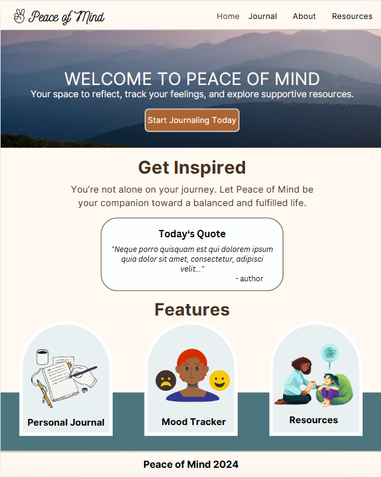
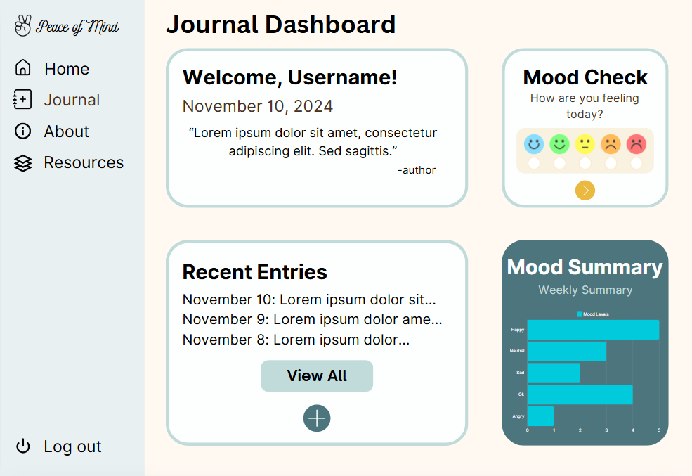
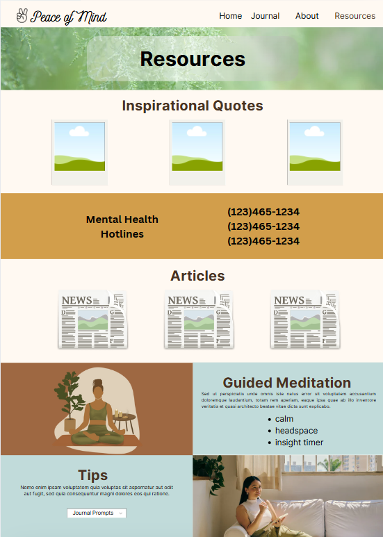
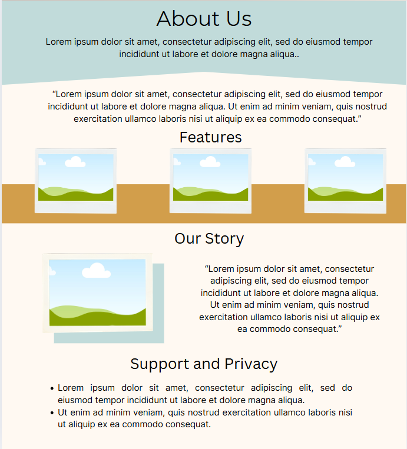

# Peace of Mind

Peace of Mind is a mental health journaling app designed to help users reflect on their emotions, track their moods, and rediscover themselves. Inspired by the Lauryn Hill song ["I Gotta Peace of Mind"](https://www.youtube.com/watch?v=pb7KjMTgK-Q) and my own journey of self-discovery, this app creates a safe space for users to pause, reflect, and find clarity in their lives.

Life often moves too fast, leaving us caught up in daily routines, self-doubt, and emotional challenges. Through features like personal journaling, mood tracking, and inspirational resources, Peace of Mind helps users reconnect with themselves and build a foundation for emotional resilience. With protected journal entries and dynamic visual tools, users can celebrate their progress and find the encouragement to keep growing.

This project is a deeply personal endeavor to offer not just an app, but a meaningful tool for those seeking balance and a better understanding of themselves. Peace of Mind is about discovering who you are and becoming the best version of yourself, one entry at a time.

## Day 1: Wireframe/Mockup & Initial Setup

### Overview

Day 1 focused on laying the foundation for the "Peace of Mind" project. This involved designing the wireframe/mockup, finalizing the overall design, selecting fonts and themes, setting up content for the website, and preparing the project for development. Additionally, the initial setup for external APIs and dependencies was completed.

### What I Did on Day 1:

1. **Wireframe/Mockup**

- Took time to design a clean and user-friendly wireframe/mockup.
- The wireframe helped visualize the layout, including key sections like the Journal Dashboard, Mood Tracker, and Resources page.

2. **Finalize Design**

- Chose a design style that aligns with the peaceful and calming nature of the project. This includes soft colors, easy navigation, and an intuitive layout.
- I focused on simplicity and ease of use, ensuring users feel comfortable navigating through the app.

3. **Theme and Fonts**

- Spent time experimenting with various color themes and fonts to find a calming aesthetic. The final choice features a soft, neutral color palette with contrasting elements for clarity.
- Chose a combination of serene fonts for headings and clean, readable fonts for body text, ensuring a cohesive visual experience.

4. **Content**

- Developed the core content for the website, including call-to-action messages, slogans, and other key text.
- The messaging focuses on promoting mental well-being and self-care, with slogans like "Start Your Journey to Peace" and "Find Calm in the Chaos."

5. **Setup Project**

- Created the initial project structure and set up the development environment.
- Installed necessary dependencies to start building out the app.

6. **Install Dependencies**

- Installed key dependencies including Tailwind CSS for styling and DaisyUI for easy theme and component management.
- Set up ZenQuotes API for inspirational quotes and API Ninja Quotes for additional quote sources.

7. **Config Files (Font and DaisyUI)**

- Updated \_app.js to apply fonts help with site's visual appearance.
- Updated `tailwind.config.js` to integrate custom color themes and enable switching (light and dark modes) using DaisyUI.

8. **Setup .env**

- Set up environment variables in .env for storing sensitive data such as API keys and API url.

9. **Create Todos**

- Created a list of todos for the upcoming days to track development progress and ensure a systematic approach to the project.

### What I Learned

- **Set Up Tailwind CSS & DaisyUI:** I configured Tailwind and DaisyUI, learning how to customize themes and extend Tailwind’s default settings. [Resource](https://daisyui.com/docs/themes/)
- **Adding Google Fonts to Next.js:** I learned how to import Google Fonts into my Next.js project to ensure the typography was consistent with the design and feel of the app. [Resource](https://nextjs.org/docs/pages/building-your-application/optimizing/fonts)
- **Use Local Storage & Theme Switching:** I implemented a theme toggle feature, which saves user preferences (light/dark mode) in local storage and updates the UI accordingly. [Resource](https://selftaughttxg.com/2023/05-23/learn-local-storage-in-react-create-a-light-and-dark-theme-switcher-application/)

### Next Steps

For Day 2, I plan to:

- Begin developing the core components for the
  project.
- Test components using Storybook.

### Wireframe / Mockup

#### Home



#### Journal Dashboard



#### Resources



#### About



## Day 2: Project Development and Component Testing

### Objective

On Day 2, I focused on developing global components and setting up API routes, as well as implementing Storybook to test my components independently. During this process, I encountered compatibility issues between Next.js and Storybook, but I was able to resolve them by adjusting the installation command.

### Checklist of Tasks Completed

#### 1. Create Global Components

- Navbar: Designed a reusable navigation bar to be used across different pages for consistent site navigation.
- Sidebar (Dashboard): Built a sidebar component for the dashboard page to facilitate easy access to key sections and features within the app.
- Footer: Created a simple footer and applied it globally.

#### 2. Develop Feature-Specific Cards

- QuoteCard: Developed a card component to display inspirational quotes fetched from the Ninja Quotes API.
- Article Card: Created an article card to showcase curated articles sourced from the APA article API route.
- HoverCard: Built an interactive card with hover effects to display detailed information upon hover, enhancing user experience and engagement.

#### 3. API Routes Integration

- Ninja Quotes API Route: Set up a server-side API route to fetch quotes from the Ninja Quotes API, allowing for seamless integration of motivational quotes within the app.
- APA Article API Route: Created an API route to fetch articles from APA, giving users access to curated mental health resources.

#### 4. Implement Storybook for Component Testing

- Installed Storybook to create a visual testing environment for components.
- Due to compatibility issues between Storybook and Next.js 15, I adjusted the installation command to `npx storybook@next init` instead of the latest version to ensure compatibility. This allowed me to test components like the Navbar, Sidebar, and cards independently, ensuring they function as expected in isolation.

### Challenges Encountered

One of the main issues I faced was the compatibility between Next.js 15 and Storybook. The `npx storybook@latest init` command resulted in errors, so I had to switch to the `npx storybook@next init` version. This workaround allowed me to install Storybook successfully and continue with component testing.

### Key Takeaways

#### Setting Up Global Components

Creating reusable global components like the Navbar, Sidebar, and Footer improved the consistency and maintainability of the app. This structure ensures that any updates made to these components will automatically reflect across all pages.

#### API Routes for Dynamic Content

Implementing API routes for quotes and articles enhanced the app's interactivity by enabling real-time data fetching, which enriches the user experience. The QuoteCard and Article Card components make use of these routes to display dynamic, up-to-date content.

#### Using Storybook for Isolated Component Testing

Storybook proved invaluable for testing components in isolation. This approach not only helped identify issues early but also improved my workflow by providing a visual representation of each component. Adjusting the installation to use `npx storybook@next init` was an important lesson in addressing compatibility issues.

## Day 3: Home Page Development

### Overview

On Day 2, I focused on building the homepage layout and setting up the structure for other core pages of the project. The primary goal was to create a visually appealing and responsive homepage that fits well on different screen sizes. I also added foundational components and pages for future content, laying the groundwork for further development.

### Key Accomplishments

#### 1. Homepage Layout and Responsive Design

- **Hero Section:** Created a welcoming hero section with a background image, an inviting message, and a call-to-action button to start journaling.
- **Quotes Section:** Integrated a section to display an inspirational quote, with loading state management to handle data retrieval from the quote API.
- **Features Section:** Showcased key app features (Journal, Mood Tracker, Resources) using a HoverCard component for a dynamic, user-friendly experience.

#### 2. Global Components Integration

- **Navbar:** Added a navigation bar for easy access across pages.
- **Footer:** Included a footer for a polished, consistent look.
- **QuoteCard:** Created a reusable QuoteCard component for displaying quotes fetched from the API.
- **HoverCard:** Developed an interactive HoverCard component to highlight features on hover, enhancing engagement.

#### 3. Page Setup

- Initialized the following pages with a static layout including the Navbar, Header, and Footer:
  - **Journal:** Placeholder for the personal journal dashboard.
  - **Resources:** Page for curated mental health resources.
  - **About:** Simple layout to introduce the purpose and vision of the project.

#### 4. Journal Entry Modal

- Created a journal entry form modal for the Journal page, where users can write daily reflections and observations. This form will allow for future development of tracking and saving journal entries.

### Next Steps

- **Develop the Journal Dashboard:** Begin implementing the Journal Dashboard, where users can view and manage their journal entries and track mood over time.

## Days 4 and 5: Components, API Routes, and Journal Dashboard Updates

### Overview

Over the past two days, I focused on developing new components, implementing API routes, and improving the layout of the **Journal Dashboard** and **Resources** pages. While I made significant progress, I also encountered challenges that require revisiting and refining some aspects of the project.

---

### Key Accomplishments

#### 1. **New Components**

- **MoodCheck**: A component for users to quickly check in and log their current mood.
- **MoodSummary**: Displays a summary of mood trends for the user.
- **QuoteImageCard**: Fetches and displays a visually appealing quote image from the ZenQuotes API, now added to the **Resources** page.

#### 2. **API Routes**

- **Save Mood**: Created an API route for saving mood data submitted through the `MoodCheck` component. Data is stored in Redis for persistence.
- **Get Moods**: Added an API route to retrieve stored mood data for the `MoodSummary` component.

#### 3. **Journal Page Updates**

- Added key sections to the **Journal Dashboard**, including:
  - A **Welcome Message** to greet the user.
  - The **Mood Check-In** form for logging moods.
  - The **Mood Tracker Summary** to visualize mood trends over time.

#### 4. **Resources Page**

- Imported and utilized the **QuoteImageCard** component to display inspirational quotes on the **Resources** page.

#### 5. **Testing**

- Implemented **Storybook** testing for the `MoodCheck` component, ensuring its functionality and appearance align with expectations.

---

### Challenges

#### 1. **Chart.js Compatibility**

- Encountered issues with **Chart.js** not working on the deployed site due to compatibility problems with Next.js 19. While it works locally, the library causes errors during deployment.
- **Next Steps**: I explored alternative chart libraries but faced similar issues. My plan is to:
  - Research creating a custom chart solution tailored to my needs.
  - Revisit this task after completing other components to avoid getting stuck.

#### 2. **Journal Dashboard Layout**

- Struggled with layout issues on smaller screens, particularly with the **Journal Dashboard** page. The grid layout did not scale well, leading to cluttered visuals.
- **Next Steps**: Transition to a **Flexbox** layout for better adaptability across screen sizes.

#### 3. **ZenQuotes API Issues**

- The ZenQuotes API occasionally fails to fetch data. While reviewing the API documentation for solutions, I am considering alternatives, including building my own API for more control.

---

### Next Steps

- **Work on the Resources and About Pages**: Take a step back from the challenging tasks (e.g., charts and ZenQuotes API) to focus on the static content and design of these pages.
- **Revisit Journal Dashboard Layout**: Implement the Flexbox solution for better responsiveness.
- **Explore Alternatives for Charts and Quotes**: If current tools and APIs continue to pose issues, consider custom solutions or alternative libraries.

---

## Summary

Days 4 and 5 were productive, as I introduced new components, API routes, and features to enhance the functionality of the **Journal Dashboard** and **Resources** pages. However, challenges with compatibility and layout pushed me to prioritize and plan for incremental improvements. Stepping away from these obstacles temporarily will allow me to return with fresh ideas and solutions while making progress on other parts of the project.

## Day 6 README: Resource Page Completion

### Overview

On **Day 6**, I focused on completing the **Resource Page** for the **Peace of Mind** project. This page consolidates helpful resources, tools, and guidance to support mental well-being. Here’s a breakdown of the tasks and components I worked on:

---

### Tasks Completed

1. **ArticleData Component**:

   - Created a static `ArticleData` component to fetch and manage article data due to challenges with dynamic API fetching.
   - Integrated the article data into the `ArticlesSection` for easy rendering.

2. **ArticlesSection**:

   - Displayed a grid of article cards with titles, descriptions, tags, and links to resources.
   - Added a header with a motivational tagline.

3. **HotlineSection**:

   - Created a simple section to list crisis and prevention hotline numbers for various regions.
   - Focused on providing direct and accessible support information.

4. **Image Quotes API Route**:

   - Built an API route (`/api/image-quotes`) to provide data for the `QuotesImageCard` component.
   - Updated `QuotesImageCard` to display dynamic quote data fetched from the API.

5. **BreathingExercise Component**:

   - Implemented a guided breathing exercise inspired by Google's deep breathing feature.
   - Added:
     - A background image for calming visual aesthetics.
     - Royalty-free audio for an immersive experience.
     - Step transitions with animations for inhale, hold, exhale, and rest phases.

6. **GuidedMeditationSection**:

   - Embedded a guided meditation player from Insight Timer.
   - Incorporated the `BreathingExercise` component for a comprehensive relaxation toolkit.

7. **JournalPrompts Component**:

   - Developed a dropdown-powered journal prompts feature using DaisyUI.
   - Categorized prompts into themes like Growth, Mindset, Self-Discovery, and Reflection.

8. **TipsSection Component**:

   - Added a section with:
     - Practical tips on mood tracking and journaling.
     - Integration of the `JournalPrompts` component for easy user access.
     - Visual elements like an image to enhance the layout.

9. **Final Resource Page**:
   - Combined all the above sections to create a cohesive and functional page.
   - Styled with Tailwind CSS and DaisyUI to ensure a responsive and polished UI.

---

### Challenges and Solutions

- **Challenge**: Fetching articles dynamically was inconsistent.
  - **Solution**: Used a static data component (`ArticleData`) as a workaround for the short term.
- **Challenge**: Randomizing quotes for the `QuoteImageCard` component.
  - **Solution**: Implemented a utility function to select three unique quotes from the API response.

---

### Preview

The completed Resource Page includes:

- **Daily Dose of Positivity**: Motivational quotes fetched dynamically.
- **Hotline Section**: Emergency contacts for immediate support.
- **Self-Help Articles**: Curated reading material for mental well-being.
- **Guided Meditation Section**: Breathing exercises and embedded audio tools.
- **Tips Section**: Advice and journal prompts to inspire users.

---

This concludes Day 6, successfully completing the Resource Page for the **Peace of Mind** project. 😌✌️

Here’s a detailed README draft documenting your Day 7 progress for the "Peace of Mind" project:

---

## Peace of Mind Project - Day 7 Progress

### Overview

On Day 7, I focused on resolving compatibility issues, enhancing dynamic features, and finalizing core components for the **Journal Dashboard** page. This update significantly improved the project's usability and functionality by integrating advanced visualization, dynamic API fetching, and a clean user experience.

---

### Key Updates

#### 1. **Resolved Compatibility Issues**

- **Downgraded Next.js, React, and ReactDOM:**  
  Addressed versioning conflicts by downgrading to earlier compatible versions:

  - Next.js: 14.2.15
  - React: 18
  - ReactDOM: 18

- **Fixed Chart Issue with Recharts:**  
  Successfully integrated **Recharts** to replace the previous chart library, ensuring better compatibility and performance for mood tracking visualizations.

---

#### 2. **Journal Dashboard Finalized**

The Journal Dashboard was refined to include the following features:

#### a) **Components**

- **JournalEntries:** Displays a paginated list of recent journal entries, with options to "view more" for detailed access.
- **JournalForm:** Allows users to submit daily entries, ensuring a seamless journaling experience.
- **MoodChart:** Visualizes mood data dynamically, giving users insights into their emotional patterns.
- **MoodCheck:** Enables users to make quick mood entries, fostering consistent self-reflection.
- **Sidebar:** Provides intuitive navigation between pages.
- **QuoteCard:** Fetches and displays an inspirational quote from the Ninja API, enhancing the user experience with motivational content.

#### b) **Layout**

The page follows a responsive grid layout with four sections:

- **Welcome Header:** Personalized greeting to the user.
- **Quick Mood Entry:** Simplified mood tracking input.
- **Journal Entries Overview:** Displays recent entries with pagination.
- **Mood Tracker Summary:** Visual representation of user mood data.

#### c) **Dynamic Features**

- **API Fetching:** Integrated seamless data fetching for journal entries, mood tracker, and quotes.
- **Pagination:** Users can easily navigate through past journal entries.
- **Mood Tracker Visualization:** Provides an interactive overview of mood trends over time.

---

### Challenges and Resolutions

- **Chart Library Compatibility:**  
  **Issue:** Initial integration caused errors due to library versioning.  
  **Solution:** Replaced with Recharts, ensuring compatibility and functionality.

---

## **Day 8: Login Page and Magic Link Authentication**

On Day 8, I focused on implementing the login page and the magic link authentication process. This involved creating the login page UI and functionality to send a magic link via email for secure authentication. Here's what was accomplished:

- **Implemented Login Page**:

  - Created a form to collect user email and username.
  - Added functionality to send a POST request to the `/api/send-magic-link` endpoint.
  - Displayed a confirmation message upon successfully sending the magic link.

- **Magic Link API Endpoint (`send-magic-link.js`)**:

  - Used **Upstash Redis** to store temporary tokens associated with user email and username for authentication.
  - Generated unique tokens using `randomUUID`.
  - Sent an email with a magic link using **Resend API**.

- **Auth Page**:
  - Built an authentication page to validate tokens.
  - Fetched and validated user tokens via the `/api/auth` endpoint.
  - Redirected authenticated users to the journal dashboard or back to the login page upon failure.

## **Day 9: About Page and Authentication Integration**

On Day 9, the focus shifted to finalizing the About page, styling the authentication page, and securing the Journal Dashboard page.

- **About Page**:

  - Completed the About page content, highlighting the mission and purpose of the app.
  - Styled the page with custom themes using **DaisyUI** and **TailwindCSS**.

- **Authentication Route**:

  - Completed the `/api/auth` endpoint to handle token validation.
  - Added functionality to store and retrieve user session data in Redis.

- **Journal Dashboard**:
  - Secured the Journal Dashboard by checking for valid tokens before granting access.
  - Added logic to redirect unauthenticated users back to the login page.

## **Next Steps**:

- Enhance user experience by adding authenication to journal entries and moods sections.
- Implement logout functionality and token expiration handling.
- Finalize any remaining styling updates for a cohesive user interface.

---

## Day 10: Debugging Challenges

Today was a true developer's day—filled with relentless debugging and learning through trial and error. My focus was on fixing issues related to fetching user-specific journal entries and moods in my **Peace of Mind** project. Here's an overview of what I worked on:

---

### 🛠️ **Key Updates and Fixes**:

1. **Validation Utilities**:  
   Added a utility function to handle validating tokens and emails for authentication. This helped ensure API requests were secure and accurate.

2. **Redis Data Handling**:

   - Redis was returning an object, not JSON, which meant parsing the data was unnecessary.
   - Adjusted code to use the raw object directly, resolving issues with incorrect data handling.

3. **Improved Debugging Techniques**:

   - Logged nearly everything using `console.log` to track down errors.
   - This iterative approach revealed issues with missing authentication details, response parsing, and API endpoint parameters.

4. **Error Feedback**:  
   Enhanced error messages in both the **JournalEntries** and **MoodChart** components to provide clear feedback for failed API calls.

5. **Loading States**:  
   Improved UX by refining loading indicators and handling edge cases (e.g., no entries or moods found).

---

### Lessons Learned:

- 🧩 Debugging is a puzzle: Fixing one issue often uncovers another, but persistence pays off.
- 🛠️ Always understand the data format being returned by APIs and databases.
- 🕵️‍♂️ Detailed logging is invaluable for identifying root causes of errors.

---

### Components Updated:

1. **JournalEntries.jsx**:

   - Validated tokens and emails before fetching entries.
   - Resolved data parsing issue by using the raw Redis object directly.

2. **JournalForm.jsx**:

   - Enhanced error handling for failed submissions.
   - Added user feedback for successful entries.

3. **MoodChart.jsx**:

   - Improved data mapping for mood entries using predefined days of the week.
   - Refined the chart's visualization and error logging.

4. **MoodCheck.jsx**:
   - Redirected unauthenticated users to the login page.
   - Improved form validation for tracking moods.

---

Despite the challenges, today was a great learning experience, and the app is now more robust.

## Getting Started

First, clone repository and install dependencies:

```bash
git clone <repo url>
npm install
```

Then, run the development server:

```bash
npm run dev
# or
yarn dev
# or
pnpm dev
# or
bun dev
```

Open [http://localhost:3000](http://localhost:3000) with your browser to see the result.

## Photo Credits

- Journal Photo by Jess Bailey Designs
- Resources Photo by vectorjuice (Freepik)
- Mood Photo by pch.vector (Freepik)
- Hero Image by Alexandro David
- Sky Photo by Ithalu Dominguez
- Stars Photo by Toni Ferreira
- Light Photo by Singkham
- Road Photo by Nout Gons
- Mountain Photo by Simon Berger
- Ice Photo by Pixabay
- Meditate Photo by Freepik
- Notebook Photo by Freepik
- Login Photo By: Kaboompics.com
- Secure Photo by Miguel Á. Padriñán

## Royalty Free Music

Song by <a href="https://stocktune.com/free-music/whispers-of-the-stream-66136-56579">StockTune</a>

## Project Powerpoint

[Presentation](https://www.canva.com/design/DAGXTvOYTkY/2J0FlKXhIi_dXSiueLP0vw/view?utm_content=DAGXTvOYTkY&utm_campaign=designshare&utm_medium=link&utm_source=editor)
